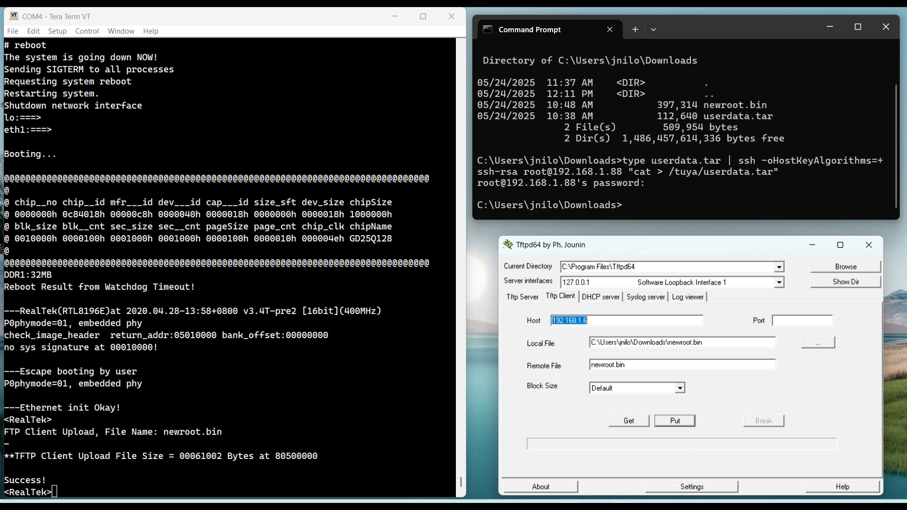

# 🛠️ Installing the New Root Filesystem (rootfs) on the Gateway

This guide explains how to install the new root filesystem (`newroot.bin`) and configure your gateway from either a **Windows** or a **Linux** host.

> ⚠️ **Important:** Before proceeding, I urge you to back up your current flash partitions. See the [20-Backup-Restore section](../20-Backup-Restore/)
---

## ✨ What's New in This Root Filesystem

This updated root filesystem includes several enhancements:

- ✅ **[BusyBox 1.37.0](https://busybox.net/)** — latest version with a revised and optimized set of applets  
- ✅ **[Dropbear 2025.88](https://matt.ucc.asn.au/dropbear/dropbear.html)** — latest version with key-only login support and no more *-o HostKeyAlgorithms=+ssh-rsa* parameter needed !
- ✅ **Serialgateway Supervisor** — extends Paul Bank’s original tool with automatic restart on disconnection  
- ✅ **Streamlined Init Scripts** — core scripts reside in the read-only SquashFS (`mtd2`), while editable ones are in the writable user space (`mtd4`), providing greater flexibility  
- ✅ **No More /tuya directory in mtd4** — all Tuya-related components have been removed; `mtd3` is still defined by the kernel but now unused. 
- ✅ **Custom RootFS Support** — you can rebuild and customize your own root filesystem by following the instructions in the *[Create the Root Filesystem](../23-Create%20the%20Root%20Filesystem/)* section
- ✅ The three components needed to run the gateway (busybox, dropbear and serialgateway) are statically compiled to limit the global footprint (the size of this rootfs is only 389K)

Enjoy your clean and powerful embedded Linux environment!

---

## 📦 Step 1: Unpack `userdata.tar` on the Gateway

1. Connect the gateway 1/ via Ethernet and 2/ via a serial terminal (@ 38400 bauds, 8N1).

   ⚠️ You should favor a terminal that supports **auto-reconnection** when devices are disconnected and reconnected during gateway reboots.

   - **On Windows**:
     - I personally use a windows terminal launching [Simply Serial](https://github.com/fasteddy516/SimplySerial) with the following command line:
       ```
       ss -c:4 -b:38400 -p:none -d:8 -s:1 -quiet -nostatus
       ```
     - [Teraterm](https://github.com/TeraTermProject/teraterm/releases) is another excellent choice.
     - Avoid *Putty*, which does not handle disconnects well.

   - **On Linux**:
     - [Minicom](https://help.ubuntu.com/community/Minicom) is a natural choice.

2. Transfer the `userdata.tar` archive to the `/tuya` directory on the gateway.


   From a Windows host:

   ```sh
   type userdata.tar | ssh -oHostKeyAlgorithms=+ssh-rsa root@gateway_ip_address "cat > /tuya/userdata.tar" 
   ```
   From a Linux host:

   ```sh
   ssh -oHostKeyAlgorithms=+ssh-rsa root@gateway_ip_address "cat > /tuya/userdata.tar" < userdata.tar
   ```

3. Log in to the gateway and unpack the archive:

   ```sh
   cd /tuya
   tar -xf userdata.tar
   ```

   This will create and populate the following directories:

   * `/tuya/etc`
   * `/tuya/ssh`
   * `/tuya/usr`
---
Here is the content of userdata.tar. Most files are symlinked to the readonly squashfs rootfs but can be modified since they are stored on the writable partition (mtd4) of the gateway.
```sh
├── etc
│   ├── TZ                        # Variable defining your local time zone
│   ├── dropbear                  # Directory containing dropbear server keys (generated once at first logging)
│   ├── eth1.bak                  # eth1.conf sample file for defining eth1 fixed IP
│   ├── hostname                  # Now zigbeegw but you can rename it :-)
│   ├── init.d                    # user script directory. You can add more or modify those provided below
│   │   ├── S20time               # By default launch once the ntp client to set the local time. See script header.
│   │   ├── S30dropbear           # Launch dropbear. Can be modified to restrict login through keys only. See script header.
│   │   └── S60serialgateway      # Launch my own version of serialgateway. See below for more details. 
│   ├── motd                      # Message of the day. Can be modified.
│   ├── ntp.conf                  # ntp client servers
│   ├── passwd                    # root password file
│   └── profile                   # terminal settings.
├── ssh
│   └── authorized_keys           # file to store your hosts public keys
└── usr
    ├── bin                       # You can add here any program you would like to use
    │   ├── serialgateway         # Supervise serialgateway.real to make sure serialgateway is always up and running
    │   └── serialgateway.real    # The "real", historical serialgateway.
    └── sbin                      # You can add here any program you would like to use
```
4. Adjust /tuya/etc directory to your own needs

   4.1 By default `syslogd` and `klogd` daemons will be started on reboot by `S05syslog`. If you want to disable them just `touch nosyslog` in `/tuya/etc/`

   4.2 Set your local timezone into the `TZ` variable in POSIX TZ format. I you have a running linux machine you can find the value of the `TZ` variable with a simple `cat` command e.g.:
      ```
      jnilo:~$ cat /usr/share/zoneinfo/America/Chicago | strings | tail -1
      CST6CDT,M3.2.0,M11.1.0
      jnilo:~$ cat /usr/share/zoneinfo/Europe/Paris | strings | tail -1
      CET-1CEST,M3.5.0,M10.5.0/3
      jnilo:~$
      ```

   4.3 If you want to boot with a fixed IP:
   `mv eth1.bak eth1.conf`
   Then edit `eth1.conf` according to your needs
   
   4.4. Miscellaneous
   Finally, you can also adjust, if needed, `hostname` and `motd` variables. Also check `S20time` and `S30dropbear` scripts if you want to adjust the relevant parameters (check scripts headers)


## 💻 Step 2: transfer the new root filesystem `newroot.bin` to the Gateway

The flashing procedure is identical for both Windows and Linux. The only difference is how the `newroot.bin` file is transferred to the gateway.

- Download `newroot.bin` and place it in the `Downloads` folder of your host (linux or windows).

- Reboot the gateway trough the serial terminal while pressing `Esc` repeatedly to access the `Realtek>` bootloader prompt. By default the bootloader is reachable over TFTP at IP=192.168.1.6. This address can be changed through the IPCONFIG bootloader command (e.g. IPCONFIG 10.0.0.1) if already being used or if your host is not on the same subnet.

### 🪟 Windows Host: Use Tftpd64

Unfortunately the native windows tftp client is not recognized by the Realtek bootloader tftp server. We have to install Tftpd64.

1. Install Tftpd64:

   * Official site: [https://pjo2.github.io/tftpd64/](https://pjo2.github.io/tftpd64/)
   * Mirrors:
     * [https://tftpd64.apponic.com/download/](https://tftpd64.apponic.com/download/)
     * [https://tftpd64.software.informer.com/](https://tftpd64.software.informer.com/)
     * [https://en.freedownloadmanager.org/Windows-PC/Tftpd64-FREE.html](https://en.freedownloadmanager.org/Windows-PC/Tftpd64-FREE.html)

2. Open Tftpd64, click on the **tftp client** tab and configure as follows:
   
   * **Host**: `192.168.1.6`
   * **Local File**: search your windows directory to access `newroot.bin`
   * **Remote File**: `newroot.bin`
   * Click **Put**

See the following picture with a Teraterm on the left and Tftpd64 on the right.

   <p align="center">
     
   </p>

### 🐧 Linux Host: Use tftp-hpa

1. Install `tftp` client if not already available (`sudo apt install tftp-hpa`)

2. In a terminal where your newroot.bin file  has been installed issue the following command:

   ```sh
   tftp -m binary 192.168.1.6 -c put newroot.bin
   ```
---

## 🔧 Flashing the Image from the Bootloader

1. During the tftp file transfer watch the serial console output. You should see:

   ```
   <RealTek>
   **TFTP Client Upload, File Name: newroot.bin
   -
   **TFTP Client Upload File Size = 00061002 Bytes at 80500000
   Success!
   <RealTek>
   ```
Make sure that File Size is 00061002 before proceeding to the next step.

2. Then, enter the following command to write the image to flash:

   ```
   FLW 200000 80500000 00061002
   ```

3. Confirm when prompted:

   ```
   Write 0x00061002 Bytes to SPI flash#1, offset 0x00200000<0xbd200000>, from RAM 0x80500000 to 0x80561002
   (Y)es, (N)o->Y
   ..................................................................................................<RealTek>
   ```

4. Reboot the gateway 

   Be patient with the first reboot since it will take some time to generate the Dropbear server keys.
---

## 🔐 Post-Installation Configuration

After reboot:
1. **Log in : root  -  Password : root**

2. **Change the root password immediately**:

   ```sh
   passwd
   ```

3. **Delete legacy Tuya content** (keep only essential dirs):
   Copy and paste the following:
   ```sh
   for f in /userdata/*; do
     case "$f" in
       /userdata/etc|/userdata/ssh|/userdata/usr) continue ;;
       *) rm -rf "$f" ;;
     esac
   done
   ```
---

## ✅ You're Done!

Your gateway is now running with a clean rootfs and minimal configuration.

